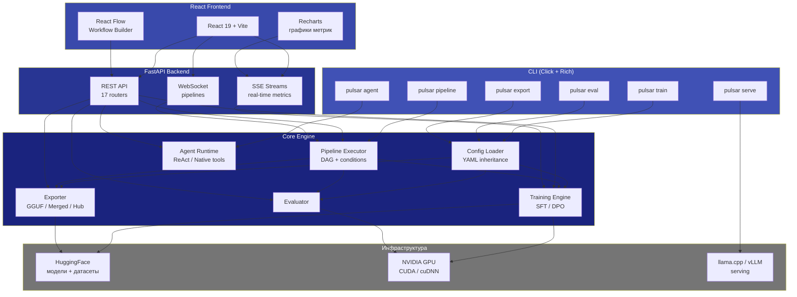
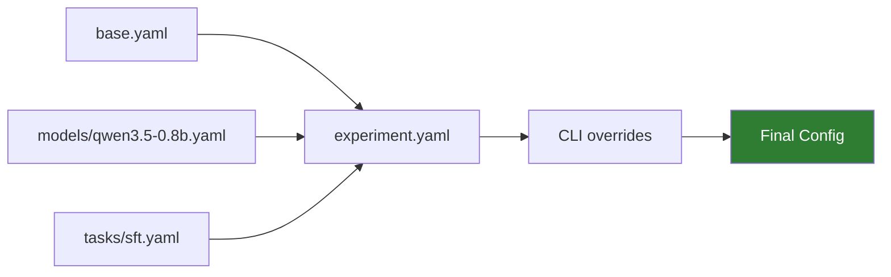
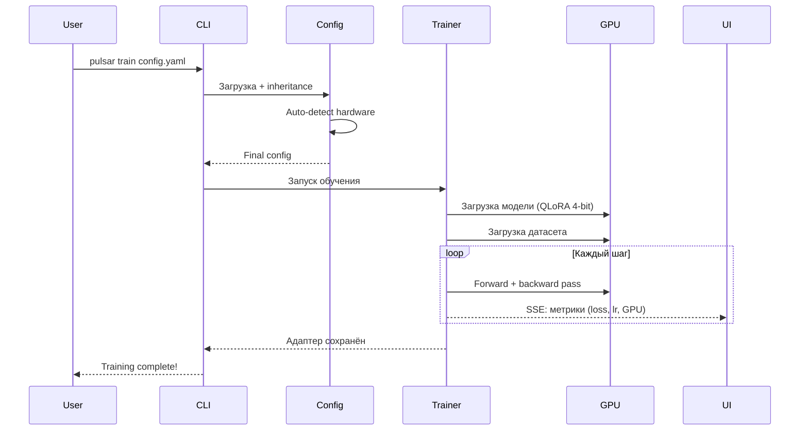
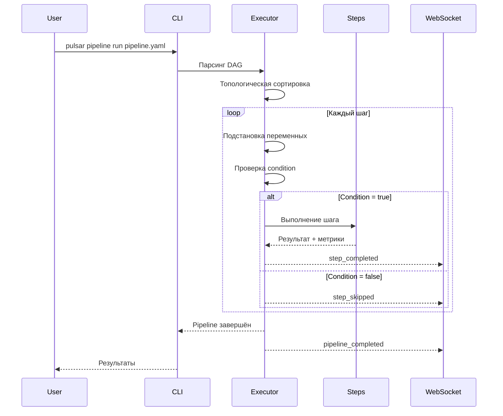

# Архитектура

Обзор компонентов pulsar-ai, их взаимосвязей и потоков данных.

---

## Общая схема

---

## Компоненты

### CLI

Точка входа для всех операций. Построен на [Click](https://click.palletsprojects.com/) с подсветкой через [Rich](https://rich.readthedocs.io/). Каждая команда (`train`, `eval`, `export`, `serve`, `agent`, `pipeline`) маршрутизирует запрос к соответствующему компоненту Core Engine.

### Config System

Система конфигурации на основе YAML с поддержкой наследования (`inherit`). Позволяет переиспользовать настройки через цепочку конфигов и переопределять любой параметр через CLI.

Приоритет (от низшего к высшему):

| Приоритет | Источник | Пример |
|-----------|---------|--------|
| 1 (низший) | `base.yaml` | seed, logging |
| 2 | Конфиг модели | model_name, lora_r |
| 3 | Конфиг задачи | task-specific параметры |
| 4 | Конфиг эксперимента | dataset, epochs |
| 5 (высший) | CLI overrides | `learning_rate=1e-4` |

Автодетекция hardware: при загрузке конфига система определяет GPU, VRAM, compute capability и автоматически подбирает стратегию обучения (`qlora`, `lora`, `full`, `unsloth`), batch size и gradient accumulation.

### Training Engine

Два режима обучения:

- **SFT** (Supervised Fine-Tuning) -- через HuggingFace `Trainer`. Поддержка LoRA/QLoRA через `peft` и `bitsandbytes`.
- **DPO** (Direct Preference Optimization) -- через TRL `DPOTrainer`. Требует предварительно обученный SFT-адаптер.

Ускорение через [Unsloth](https://github.com/unslothai/unsloth) (2--5x, только Linux).

### Evaluator

Автоматическая оценка обученных моделей:

- Метрики: accuracy, F1, precision, recall
- JSON Parse Rate (для структурированного вывода)
- Confusion matrix
- LLM-as-Judge (для открытых задач)
- Отчёты с per-class анализом ошибок

### Exporter

Три формата экспорта:

| Формат | Описание | Использование |
|--------|----------|---------------|
| **GGUF** | Квантизированный формат | llama.cpp, Ollama |
| **Merged** | Полная модель с вмёрженным LoRA | HuggingFace, vLLM |
| **Hub** | Публикация на HuggingFace Hub | Шаринг, дистрибуция |

### FastAPI Backend

REST API сервер с 17 роутерами, покрывающими все функции платформы. Поддержка SSE (Server-Sent Events) для real-time стримов метрик обучения и WebSocket для мониторинга пайплайнов.

### React Frontend

Single-page application на React 19 + Vite:

- **Recharts** -- графики метрик обучения (loss, lr, GPU memory)
- **React Flow** -- визуальный Workflow Builder с 26 типами нод
- Страницы: Experiments, Eval, Export, Datasets, Workflows, Agents, Settings и др.

### Pipeline Executor

Оркестратор многоэтапных пайплайнов:

- DAG (Directed Acyclic Graph) с топологической сортировкой
- Подстановка переменных (`${step.output}`)
- Условное выполнение шагов (`condition`)
- Параллельное выполнение независимых шагов

### Agent Runtime

Фреймворк для создания AI-агентов:

- Базовый класс `BaseAgent` с циклом Thought -> Action -> Observation
- Два режима tool calling: ReAct (текстовый) и Native (JSON function calling)
- Подключаемая память: buffer, summary, vector
- Guardrails: prompt injection, PII masking, toxicity filtering

---

## Потоки данных

### Жизненный цикл обучения

### Выполнение пайплайна

---

## Технологический стек

| Слой | Технологии |
|------|-----------|
| **CLI** | Click, Rich, PyYAML |
| **Training** | PyTorch, HuggingFace Transformers, TRL, PEFT, bitsandbytes |
| **Acceleration** | Unsloth (Linux), Flash Attention 2 |
| **Backend** | FastAPI, Uvicorn, SSE-Starlette, WebSockets |
| **Frontend** | React 19, Vite 6, TypeScript, Recharts, React Flow |
| **Serving** | llama.cpp (llama-cpp-python), vLLM |
| **Export** | llama.cpp (convert), HuggingFace Hub |
| **HPO** | Optuna |
| **Tracking** | Встроенный, ClearML, Weights & Biases |
| **Agents** | OpenAI SDK, LangChain-совместимые tools |
