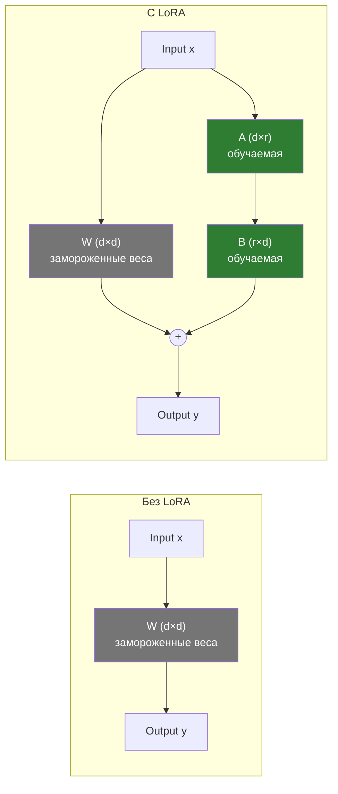
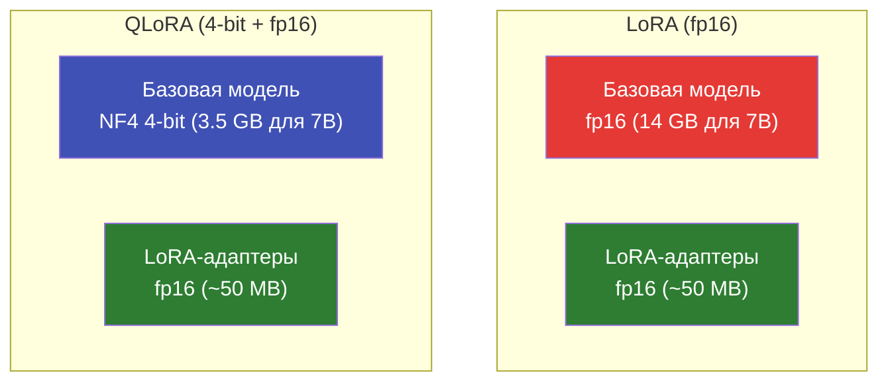

# LoRA и QLoRA

Как работают LoRA и QLoRA, зачем они нужны и как выбрать параметры для вашей задачи.

---

## Что такое файнтюнинг

Файнтюнинг (fine-tuning) -- процесс дообучения предобученной языковой модели на задаче-специфичных данных. Предобученная модель уже "знает" язык и мир; файнтюнинг адаптирует её к конкретной задаче (классификация, генерация в заданном формате, следование инструкциям) с минимальным количеством данных и вычислительных ресурсов.

---

## Full Fine-Tuning vs PEFT

### Full Fine-Tuning

Обновляются **все** параметры модели. Для 7B-модели это 7 миллиардов параметров.

- Требует огромного объёма VRAM (14+ GB для 7B в fp16)
- Лучшее качество при достаточных ресурсах
- Риск catastrophic forgetting (модель "забывает" общие знания)
- Практически нереально на потребительских GPU для моделей >3B

### PEFT (Parameter-Efficient Fine-Tuning)

Обновляется только **малая часть** параметров. Основной метод -- LoRA.

- Требует в 5--10x меньше VRAM
- Качество сравнимо с full fine-tuning
- Базовая модель не изменяется -- легко откатить или объединить адаптеры
- Быстрое обучение и малый размер адаптера (10--100 MB)

---

## LoRA: Low-Rank Adaptation

### Идея

Вместо обновления всей матрицы весов W (размер d x d), LoRA добавляет две маленькие матрицы A (d x r) и B (r x d), где r << d.



Итоговая формула: `y = Wx + BAx`

- Матрица W **заморожена** (не обновляется)
- Обучаются только A и B
- Ранг r определяет "ёмкость" адаптера

### Ключевые параметры

| Параметр | Описание | Типичные значения |
|----------|----------|-------------------|
| `lora_r` | Ранг (размерность промежуточного пространства) | 8, 16, 32, 64 |
| `lora_alpha` | Масштабирующий коэффициент (обычно 2x от r) | 16, 32, 64 |
| `target_modules` | К каким слоям применять LoRA | `q_proj`, `k_proj`, `v_proj`, `o_proj` |
| `lora_dropout` | Dropout для регуляризации | 0.0, 0.05, 0.1 |

### Как выбрать ранг (r)

| Ранг | Обучаемых параметров (7B модель) | Скорость | Качество | Когда использовать |
|------|----------------------------------|----------|----------|--------------------|
| **r=8** | ~4M (0.06%) | Быстро | Хорошее | Простые задачи (классификация, форматирование) |
| **r=16** | ~8M (0.11%) | Средне | Отличное | Большинство задач (рекомендуется по умолчанию) |
| **r=32** | ~17M (0.24%) | Медленнее | Превосходное | Сложные задачи (генерация, рассуждения) |
| **r=64** | ~34M (0.48%) | Медленно | Максимальное | Когда r=32 недостаточно (редко) |

!!! tip "Правило выбора"
    Начните с **r=16**. Если качество недостаточно -- увеличьте до 32. Если VRAM не хватает
    или задача простая -- уменьшите до 8. Ранг 64 нужен редко и даёт минимальный прирост
    относительно 32.

### target_modules

LoRA применяется к линейным слоям трансформера. Чем больше слоёв покрыто, тем выше "ёмкость" адаптации, но и больше обучаемых параметров.

| Конфигурация | Модули | Параметров | Когда |
|-------------|--------|-----------|-------|
| Минимальная | `q_proj`, `v_proj` | Мало | Быстрые эксперименты |
| **Стандартная** | `q_proj`, `k_proj`, `v_proj`, `o_proj` | Средне | **Рекомендуется** |
| Расширенная | + `gate_proj`, `up_proj`, `down_proj` | Много | Максимальная адаптация |

---

## QLoRA: Quantized LoRA

### Идея

QLoRA комбинирует два подхода:

1. **Квантизация базовой модели** в 4 бит (через NF4 -- NormalFloat4)
2. **LoRA-адаптеры** в полной точности (fp16/bf16)



Базовая модель загружается в 4-bit, что экономит 4x VRAM. Адаптеры остаются в fp16 для сохранения точности градиентов.

### Технические детали

- **NF4 (NormalFloat4)** -- формат квантизации, оптимизированный для нормально распределённых весов нейросетей. Лучше обычного INT4.
- **Double Quantization** -- квантизация констант квантизации (сокращает overhead с ~0.5 GB до ~0.1 GB для 7B).
- **Paged Optimizers** -- optimizer states (Adam) выгружаются в RAM при нехватке VRAM.

---

## Сравнение VRAM

| Модель | Параметры | Full FT (fp16) | LoRA (fp16) | QLoRA (4-bit) |
|--------|-----------|---------------|-------------|---------------|
| Qwen3.5-0.8B | 0.8B | ~4 GB | ~3 GB | **~2 GB** |
| Qwen3.5-2B | 2B | ~8 GB | ~6 GB | **~4 GB** |
| Llama-3.2-3B | 3B | ~12 GB | ~9 GB | **~5 GB** |
| Qwen3.5-4B | 4B | ~14 GB | ~10 GB | **~6 GB** |
| Mistral-7B | 7B | ~28 GB | ~16 GB | **~8 GB** |
| Llama-3.1-13B | 13B | ~52 GB | ~30 GB | **~14 GB** |

!!! note "Что входит в VRAM"
    Указан примерный объём VRAM при batch_size=2, gradient_accumulation=8, max_seq_length=512.
    Реальное потребление зависит от длины последовательностей, размера батча
    и optimizer states.

---

## Unsloth: 2--5x ускорение

[Unsloth](https://github.com/unslothai/unsloth) -- библиотека для ускорения LoRA/QLoRA-обучения через оптимизированные CUDA-ядра.

| Характеристика | Без Unsloth | С Unsloth |
|---------------|-------------|-----------|
| Скорость обучения | Baseline | **2--5x быстрее** |
| Потребление VRAM | Baseline | **На 30--50% меньше** |
| Совместимость | Все ОС | **Только Linux** |
| Установка | -- | `pip install -e ".[unsloth]"` |

!!! warning "Ограничения Unsloth"
    - Работает **только на Linux** (нет поддержки Windows/macOS).
    - Поддерживает ограниченный набор моделей (Qwen, Llama, Mistral -- основные).
    - pulsar-ai автоматически определяет доступность Unsloth и использует его, если возможно.

Конфигурация:

```yaml
# pulsar-ai автоматически выбирает Unsloth на Linux,
# но можно задать стратегию вручную:
strategy: unsloth   # Принудительно использовать Unsloth
# strategy: qlora   # Стандартный QLoRA без Unsloth
```

---

## LoRA в pulsar-ai

По умолчанию pulsar-ai использует QLoRA для всех моделей. Конфигурация задаётся в YAML:

=== "Стандартная конфигурация"

    ```yaml
    # configs/models/qwen3.5-0.8b.yaml
    model_name: "Qwen/Qwen3.5-0.8B"
    lora_r: 16
    lora_alpha: 32
    target_modules:
      - q_proj
      - k_proj
      - v_proj
      - o_proj
    lora_dropout: 0.05
    load_in_4bit: true   # QLoRA
    ```

=== "Для сложных задач"

    ```yaml
    model_name: "Qwen/Qwen3.5-2B"
    lora_r: 32
    lora_alpha: 64
    target_modules:
      - q_proj
      - k_proj
      - v_proj
      - o_proj
      - gate_proj
      - up_proj
      - down_proj
    lora_dropout: 0.1
    load_in_4bit: true
    ```

=== "Full precision LoRA"

    ```yaml
    model_name: "Qwen/Qwen3.5-0.8B"
    lora_r: 16
    lora_alpha: 32
    target_modules:
      - q_proj
      - k_proj
      - v_proj
      - o_proj
    lora_dropout: 0.05
    load_in_4bit: false  # fp16, больше VRAM
    ```

---

## Полезные ссылки

- [LoRA: Low-Rank Adaptation of Large Language Models](https://arxiv.org/abs/2106.09685) -- оригинальная статья
- [QLoRA: Efficient Finetuning of Quantized LLMs](https://arxiv.org/abs/2305.14314) -- статья QLoRA
- [PEFT documentation](https://huggingface.co/docs/peft) -- библиотека HuggingFace
- [Стратегии обучения](training-strategies.md) -- сравнение всех стратегий в pulsar-ai
