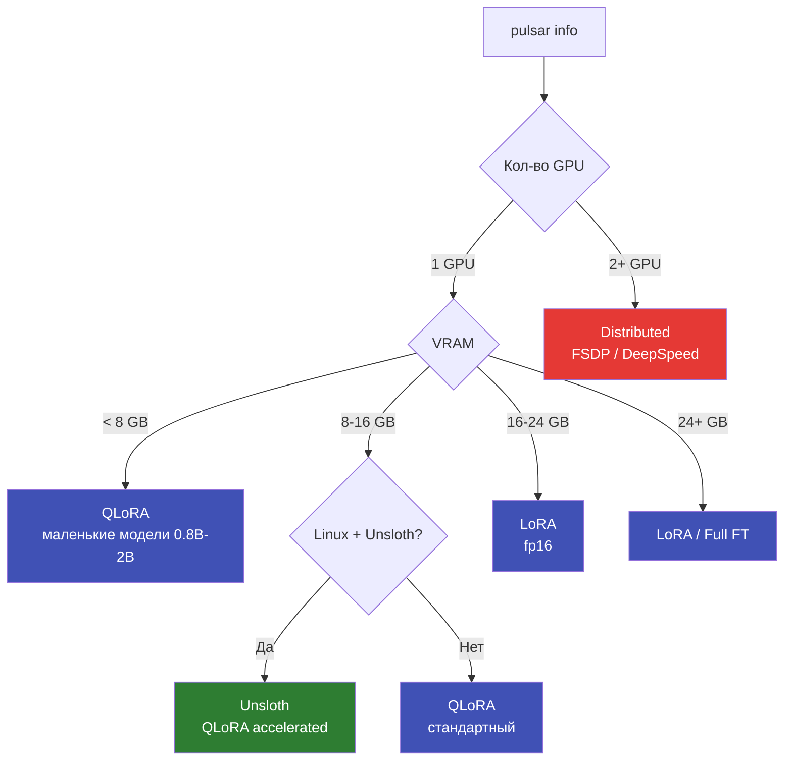

# Стратегии обучения

Сравнение стратегий файнтюнинга в pulsar-ai: QLoRA, LoRA, Full Fine-Tuning, Distributed.

---

## Сравнительная таблица

| Стратегия | VRAM (7B модель) | Скорость | Качество | Когда использовать |
|-----------|-----------------|----------|----------|--------------------|
| **QLoRA** | ~8 GB | Быстро | Хорошее (99% от full) | Потребительские GPU (6--24 GB) |
| **LoRA** | ~16 GB | Быстро | Отличное (99.5% от full) | Профессиональные GPU (24+ GB) |
| **Full Fine-Tune** | ~28 GB | Медленно | Максимальное | Исследования, серверные GPU |
| **Distributed** | ~8 GB/GPU | Зависит от кол-ва GPU | Как full fine-tune | Модели 13B+, мульти-GPU |

---

## QLoRA

Базовая модель квантизируется в 4 бит (NF4), LoRA-адаптеры обучаются в fp16/bf16.

```yaml title="Конфиг QLoRA"
strategy: qlora
load_in_4bit: true
lora_r: 16
lora_alpha: 32
target_modules: [q_proj, k_proj, v_proj, o_proj]
```

**Преимущества:**

- Минимальное потребление VRAM -- обучение 7B модели на 8 GB GPU
- Быстрый старт -- модель загружается за секунды в 4-bit
- Качество близко к full fine-tuning (потеря <1% accuracy)

**Недостатки:**

- Небольшая потеря точности из-за квантизации
- Градиенты проходят через квантизованные веса -- менее стабильный процесс
- Невозможно обучить все параметры

!!! tip "Рекомендация"
    QLoRA -- **стратегия по умолчанию** в pulsar-ai. Подходит для 90% задач
    на потребительских GPU.

---

## LoRA

Базовая модель загружается в fp16/bf16 (полная точность), обучаются только LoRA-адаптеры.

```yaml title="Конфиг LoRA"
strategy: lora
load_in_4bit: false
lora_r: 16
lora_alpha: 32
target_modules: [q_proj, k_proj, v_proj, o_proj]
```

**Преимущества:**

- Лучшее качество, чем QLoRA (нет потерь от квантизации базы)
- Стабильнее обучение (точные градиенты)
- Малый размер адаптера (10--100 MB)

**Недостатки:**

- Требует в 2x больше VRAM, чем QLoRA
- Для 7B нужно 16+ GB -- не все потребительские GPU подойдут

| Модель | QLoRA (4-bit) | LoRA (fp16) | Разница VRAM |
|--------|--------------|-------------|--------------|
| 0.8B | ~2 GB | ~3 GB | +1 GB |
| 2B | ~4 GB | ~6 GB | +2 GB |
| 7B | ~8 GB | ~16 GB | +8 GB |
| 13B | ~14 GB | ~30 GB | +16 GB |

---

## Full Fine-Tuning

Обновляются **все** параметры модели. Максимальное качество за счёт максимальных ресурсов.

```yaml title="Конфиг Full Fine-Tuning"
strategy: full
load_in_4bit: false
# lora_r не указывается -- LoRA не используется
```

**Преимущества:**

- Максимальное качество адаптации
- Все параметры обновляются -- полная гибкость

**Недостатки:**

- Огромное потребление VRAM (модель + градиенты + optimizer states)
- Медленное обучение
- Риск catastrophic forgetting
- Большой размер "адаптера" (вся модель, гигабайты)

!!! warning "VRAM для Full Fine-Tuning"
    Full fine-tuning требует примерно **4x размера модели** в VRAM (веса + градиенты + optimizer).

    | Модель | Размер модели | VRAM (full FT) |
    |--------|--------------|----------------|
    | 0.8B | ~1.6 GB | ~4 GB |
    | 2B | ~4 GB | ~8 GB |
    | 7B | ~14 GB | ~28 GB |
    | 13B | ~26 GB | ~52 GB |

---

## Distributed (FSDP / DeepSpeed)

Распределённое обучение на нескольких GPU. Модель и optimizer states делятся между GPU.

=== "FSDP (PyTorch native)"

    ```yaml title="Конфиг FSDP"
    strategy: fsdp
    distributed:
      backend: fsdp
      sharding_strategy: FULL_SHARD
      num_gpus: auto  # Использовать все доступные GPU
    ```

=== "DeepSpeed ZeRO Stage 3"

    ```yaml title="Конфиг DeepSpeed"
    strategy: deepspeed
    distributed:
      backend: deepspeed
      zero_stage: 3
      offload_optimizer: true  # Выгрузка optimizer в RAM
      offload_param: false
    ```

**Преимущества:**

- Обучение моделей 13B+ на нескольких потребительских GPU
- Линейное масштабирование (2 GPU = 2x VRAM)
- FSDP -- встроен в PyTorch, не требует доп. зависимостей
- DeepSpeed ZeRO-3 + offload: обучение 7B на 2x RTX 3060

**Недостатки:**

- Сложнее конфигурация
- Коммуникация между GPU добавляет overhead
- Требует NVLink или быструю сетевую связь для эффективности
- DeepSpeed: дополнительная зависимость (`pip install -e ".[deepspeed]"`)

### Сравнение FSDP vs DeepSpeed

| Характеристика | FSDP | DeepSpeed ZeRO-3 |
|---------------|------|-------------------|
| Зависимости | Встроен в PyTorch | Отдельный пакет |
| Offload в RAM | Нет | Да (optimizer + parameters) |
| Настройка | Проще | Гибче |
| Производительность | Высокая | Высокая (чуть лучше offload) |
| Модели | До ~30B | До 100B+ с offload |

---

## Unsloth

Не отдельная стратегия, а **ускоритель** для QLoRA/LoRA. Оптимизированные CUDA-ядра для 2--5x ускорения.

```yaml title="Конфиг Unsloth"
strategy: unsloth
load_in_4bit: true
lora_r: 16
lora_alpha: 32
```

| Характеристика | QLoRA | QLoRA + Unsloth |
|---------------|-------|-----------------|
| Скорость (tokens/s) | ~1200 | ~3500 |
| VRAM | 8 GB | 5.5 GB |
| Платформа | Все | **Только Linux** |

!!! info "Автодетекция"
    pulsar-ai автоматически выбирает Unsloth, если он установлен и запуск на Linux.
    На Windows/macOS автоматически используется стандартный QLoRA.

---

## Автовыбор стратегии

pulsar-ai автоматически определяет оптимальную стратегию на основе hardware:



Проверьте рекомендацию для вашего оборудования:

```bash
pulsar info
```

```
┌─────────────────────┬─────────────┐
│ GPU Name            │ RTX 4060    │
│ VRAM per GPU        │ 8.0 GB      │
│ Recommended Strategy│ qlora       │
│ Recommended Batch   │ 2           │
│ Recommended Grad Ac │ 8           │
└─────────────────────┴─────────────┘
```

---

## Ручное переопределение

Автовыбор можно переопределить в конфиге или через CLI:

=== "В конфиге"

    ```yaml
    strategy: lora        # Принудительно LoRA вместо QLoRA
    load_in_4bit: false
    ```

=== "Через CLI"

    ```bash
    pulsar train config.yaml strategy=lora load_in_4bit=false
    ```

!!! warning "Нехватка VRAM"
    Если вы вручную выберете стратегию, требующую больше VRAM, чем доступно,
    pulsar-ai выдаст предупреждение и предложит уменьшить batch_size
    или включить gradient checkpointing.

---

## Рекомендации по сценариям

| Сценарий | GPU | Рекомендуемая стратегия | Модель |
|----------|-----|------------------------|--------|
| Быстрый прототип | RTX 3060 (12 GB) | QLoRA | 0.8B--2B |
| Продакшен-классификатор | RTX 4060 (8 GB) | QLoRA / Unsloth | 0.8B--2B |
| Качественный чатбот | RTX 4090 (24 GB) | LoRA | 2B--7B |
| Исследование | A100 (80 GB) | Full FT / LoRA | 7B--13B |
| Большие модели | 2x RTX 4090 | Distributed (FSDP) | 7B--13B |
| Enterprise | 4x A100 | Distributed (DeepSpeed) | 13B--70B |

---

## Полезные ссылки

- [LoRA и QLoRA](lora-qlora.md) -- подробное объяснение механизма
- [Архитектура](architecture.md) -- общая схема pulsar-ai
- [Установка](../getting-started/installation.md) -- таблица extras для distributed training
