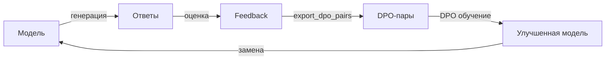

# Human Feedback

Система сбора обратной связи для замкнутого цикла улучшения модели: пользователи
оценивают ответы, оценки конвертируются в DPO-пары, которые используются для
дообучения модели.

---

## FeedbackCollector

Сбор оценок на ответы модели:

```python
from pulsar_ai.feedback import FeedbackCollector

collector = FeedbackCollector(storage_path="data/feedback.jsonl")

# Записать положительную оценку
collector.record(
    prompt="Объясни квантовые вычисления простыми словами",
    response="Квантовые компьютеры используют кубиты...",
    rating="positive"
)

# Записать отрицательную оценку
collector.record(
    prompt="Объясни квантовые вычисления простыми словами",
    response="Квантовые вычисления — это сложная тема...",
    rating="negative"
)
```

| Параметр   | Тип    | Описание                              |
|------------|--------|---------------------------------------|
| `prompt`   | `str`  | Исходный промпт пользователя          |
| `response` | `str`  | Ответ модели                          |
| `rating`   | `str`  | Оценка: `"positive"` или `"negative"` |

---

## Экспорт в DPO-пары

Конвертация собранных оценок в пары для DPO-обучения (Direct Preference Optimization):

```python
dpo_pairs = collector.export_dpo_pairs()
```

```json
[
  {
    "prompt": "Объясни квантовые вычисления простыми словами",
    "chosen": "Квантовые компьютеры используют кубиты...",
    "rejected": "Квантовые вычисления — это сложная тема..."
  }
]
```

!!! info "Формирование пар"
    DPO-пары формируются из записей с одинаковым промптом: ответ с `positive` оценкой
    становится `chosen`, с `negative` -- `rejected`. Промпты без пары (только positive
    или только negative) пропускаются.

---

## Замкнутый цикл

Полный цикл от обратной связи до улучшенной модели:



Пример полного цикла:

```python
from pulsar_ai.feedback import FeedbackCollector
from pulsar_ai.training import DPOTrainer

# 1. Собрать обратную связь (в процессе эксплуатации)
collector = FeedbackCollector(storage_path="data/feedback.jsonl")

# 2. Экспортировать DPO-пары
dpo_pairs = collector.export_dpo_pairs()
save_dataset(dpo_pairs, "data/dpo_training.jsonl")

# 3. Запустить DPO-обучение
trainer = DPOTrainer(config="configs/dpo_config.yaml")
trainer.train(dataset="data/dpo_training.jsonl")

# 4. Развернуть улучшенную модель
```

---

## Интеграция с Workflow Builder

В визуальном редакторе workflow используйте ноду `feedback` для сбора оценок:

```yaml
workflow:
  name: chatbot-with-feedback
  nodes:
    - id: llm
      type: llm
      config:
        model: my-chatbot-v2

    - id: feedback
      type: feedback
      config:
        storage: data/feedback.jsonl
        collect: true

  edges:
    - from: llm
      to: feedback
```

!!! tip "UI-интеграция"
    При включённой ноде `feedback` пользователи видят кнопки
    "thumbs up" / "thumbs down" под каждым ответом в чате.
