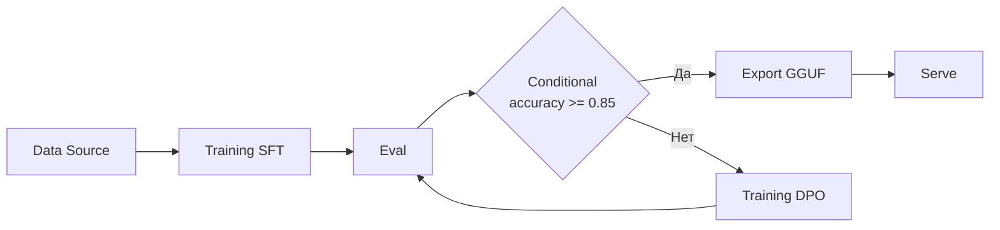

# Workflow Builder

## Обзор

Workflow Builder -- визуальный редактор пайплайнов в Web UI. Позволяет строить DAG (directed acyclic graph) из нод обработки данных, обучения, оценки и экспорта с помощью drag-and-drop. Workflow можно сохранять, запускать и экспортировать в YAML-конфиг для CLI.

---

## Типы нод

Workflow Builder содержит **26 типов нод**, организованных в **7 групп**:

### Data (Данные)

| Нода | Тип | Описание |
|---|---|---|
| Data Source | `dataSource` | Источник данных (CSV, JSONL, Parquet, HF Hub) |
| Splitter | `splitter` | Разбиение данных на train/test/val |
| Data Generation | `dataGen` | Генерация синтетических данных |

### Training (Обучение)

| Нода | Тип | Описание |
|---|---|---|
| Model | `model` | Выбор базовой модели |
| Training | `training` | SFT или DPO обучение |
| Prompt | `prompt` | Системный промпт для обучения |

### Evaluation (Оценка)

| Нода | Тип | Описание |
|---|---|---|
| Eval | `eval` | Оценка модели на тестовых данных |
| Inference | `inference` | Batch-инференс для генерации предсказаний |

### Export (Экспорт)

| Нода | Тип | Описание |
|---|---|---|
| Export | `export` | Экспорт в GGUF, merged или HF Hub |
| Serve | `serve` | Запуск модели как API |

### Agent (Агенты)

| Нода | Тип | Описание |
|---|---|---|
| Agent | `agent` | Запуск агента с инструментами |
| Router | `router` | Маршрутизация запросов между моделями |
| RAG | `rag` | Retrieval-Augmented Generation |

### Protocols (Протоколы)

| Нода | Тип | Описание |
|---|---|---|
| MCP Server | `mcp` | Model Context Protocol сервер |
| A2A | `a2a` | Agent-to-Agent коммуникация |
| Gateway | `gateway` | API Gateway для протоколов |

### Safety & Ops (Безопасность и операции)

| Нода | Тип | Описание |
|---|---|---|
| Guardrails | `guardrails` | Правила безопасности для модели |
| Conditional | `conditional` | Условное ветвление по метрикам |

### Structure (Структура)

| Нода | Тип | Описание |
|---|---|---|
| Input | `input` | Входная точка пайплайна |
| Output | `output` | Выходная точка пайплайна |
| Note | `note` | Текстовая заметка (без выполнения) |

---

## Создание workflow

### Шаг 1: Откройте Workflow Builder

1. Запустите Web UI: `pulsar ui`
2. Перейдите на страницу **Workflow Builder** в навигации

### Шаг 2: Добавьте ноды

1. На левой панели найдите нужную ноду
2. Перетащите её (drag-and-drop) на рабочую область
3. Кликните на ноду для настройки свойств в правой панели

### Шаг 3: Соедините ноды

1. Найдите выходной порт ноды (кружок справа)
2. Перетащите линию от выходного порта к входному порту следующей ноды
3. Направление соединения определяет порядок выполнения

### Шаг 4: Настройте свойства

Каждая нода имеет свои конфигурационные свойства. Например:

- **Training**: model, epochs, learning_rate, dataset_path
- **Eval**: model_path, test_data_path, metrics
- **Export**: format (gguf/merged/hub), quantization
- **Conditional**: metric, operator, threshold

---

## Кнопки управления

| Кнопка | Действие |
|---|---|
| **Save** | Сохранить workflow (локально в JSON) |
| **Load** | Загрузить ранее сохранённый workflow |
| **Run** | Запустить весь пайплайн (с WebSocket прогрессом) |
| **Export YAML** | Экспортировать workflow как pipeline YAML для CLI |

---

## Пример пайплайна

Типичный workflow: загрузка данных, обучение SFT, оценка, условный экспорт, сервинг.



### Как это работает

1. **Data Source** -- загружает датасет из CSV/JSONL
2. **Training SFT** -- обучает модель на данных
3. **Eval** -- оценивает качество на тестовой выборке
4. **Conditional** -- проверяет, достигнута ли accuracy >= 85%
    - **Да**: экспортирует модель в GGUF и запускает сервинг
    - **Нет**: запускает DPO для улучшения и возвращается к оценке

---

## API для Workflows

### CRUD-операции

=== "Список workflows"

    ```bash
    curl http://localhost:8888/api/workflows
    ```

=== "Получить workflow"

    ```bash
    curl http://localhost:8888/api/workflows/wf_abc123
    ```

=== "Сохранить workflow"

    ```bash
    curl -X POST http://localhost:8888/api/workflows \
      -H "Content-Type: application/json" \
      -d '{
        "name": "My Training Pipeline",
        "nodes": [
          {
            "id": "node1",
            "type": "dataSource",
            "data": {"label": "CSV Data", "config": {"path": "data/train.csv"}}
          },
          {
            "id": "node2",
            "type": "training",
            "data": {"label": "SFT Training", "config": {"task": "sft", "epochs": 3}}
          }
        ],
        "edges": [
          {"source": "node1", "target": "node2"}
        ]
      }'
    ```

=== "Удалить workflow"

    ```bash
    curl -X DELETE http://localhost:8888/api/workflows/wf_abc123
    ```

### Запуск workflow

```bash
curl -X POST http://localhost:8888/api/workflows/wf_abc123/run
```

Ответ:

```json
{
  "status": "started",
  "pipeline_config": {
    "pipeline": {"name": "My Training Pipeline"},
    "steps": [
      {"name": "csv_data", "type": "data", "config": {"path": "data/train.csv"}},
      {"name": "sft_training", "type": "training", "depends_on": ["csv_data"], "config": {"task": "sft"}}
    ]
  }
}
```

### Получить YAML-конфиг

```bash
curl http://localhost:8888/api/workflows/wf_abc123/config
```

---

## Экспорт в Pipeline YAML

Workflow можно экспортировать в YAML-конфиг для запуска через CLI (`pulsar pipeline run`):

```bash
# Получить конфиг из API
curl http://localhost:8888/api/workflows/wf_abc123/config > pipeline.yaml

# Запустить через CLI
pulsar pipeline run pipeline.yaml
```

Это позволяет:

- Версионировать пайплайны в Git
- Запускать пайплайны в CI/CD
- Делиться конфигурациями между командой
- Запускать на удалённых серверах без UI

!!! tip "Визуальный дизайн, текстовый запуск"
    Используйте Workflow Builder для проектирования и отладки пайплайна, затем экспортируйте YAML для автоматизации и продакшена.
