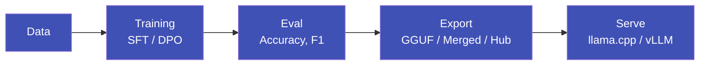

---
hide:
  - navigation
  - toc
---

# pulsar-ai

**Универсальный пайплайн файнтюнинга LLM**

Платформа полного цикла для файнтюнинга языковых моделей: от подготовки данных до продакшн-деплоя.
Web UI, CLI, REST API -- один инструмент для обучения, оценки, экспорта и сервинга моделей
с поддержкой агентов, workflow, guardrails и протоколов интеграции.

---

## Возможности

### :material-school: Training

SFT и DPO файнтюнинг с LoRA/QLoRA.
Поддержка Qwen, Llama, Mistral.
Real-time метрики в Web UI.

### :material-chart-bar: Eval

Автоматическая оценка: accuracy, F1,
JSON parse rate, confusion matrix.
LLM-as-Judge для открытых задач.

### :material-export: Export

GGUF (q4_k_m, q8_0, f16), merged LoRA,
push на HuggingFace Hub.
Одна команда -- готовый артефакт.

### :material-server: Serving

llama.cpp и vLLM бэкенды.
OpenAI-совместимый API (`/v1/chat/completions`).
Метрики latency, RPS, tokens/sec.

### :material-sitemap: Workflow Builder

Визуальный конструктор ML-пайплайнов.
26 типов нод: data, training, eval,
export, agent, protocols, guardrails.

### :material-robot: Agent Framework

Создание AI-агентов с инструментами и памятью.
Native function calling и ReAct.
Деплой агента как REST API.

### :material-monitor-dashboard: Monitoring

Real-time мониторинг GPU, CPU, RAM.
Температура, потребление энергии.
SSE-поток метрик каждые 2 секунды.

### :material-database: Model Registry

Версионирование моделей с жизненным циклом:
registered -> staging -> production -> archived.
Сравнение метрик между версиями.

### :material-tune: HPO

Автоматический поиск гиперпараметров
через Optuna. Log-uniform, categorical,
integer search spaces.

### :material-text-box-edit: Prompt Lab

Версионирование промптов, шаблоны
с переменными, diff между версиями,
тестовая панель.

### :material-protocol: Protocols (MCP / A2A)

Model Context Protocol, Google A2A,
API Gateway. Интеграция с внешними
системами через стандартные протоколы.

### :material-shield-check: Guardrails

Защита входа и выхода модели: PII,
prompt injection, toxicity, regex,
JSON schema, length validation.

---

## Архитектура

---

## Быстрые ссылки

### [:material-rocket-launch: Быстрый старт](getting-started/quickstart.md)

Запустите первый эксперимент за 5 минут.

### [:material-download: Установка](getting-started/installation.md)

Полное руководство по установке и настройке.

### [:material-console: CLI справочник](reference/cli.md)

Все команды `pulsar` с примерами.

### [:material-api: API Reference](reference/api.md)

REST API эндпоинты и Swagger-документация.

