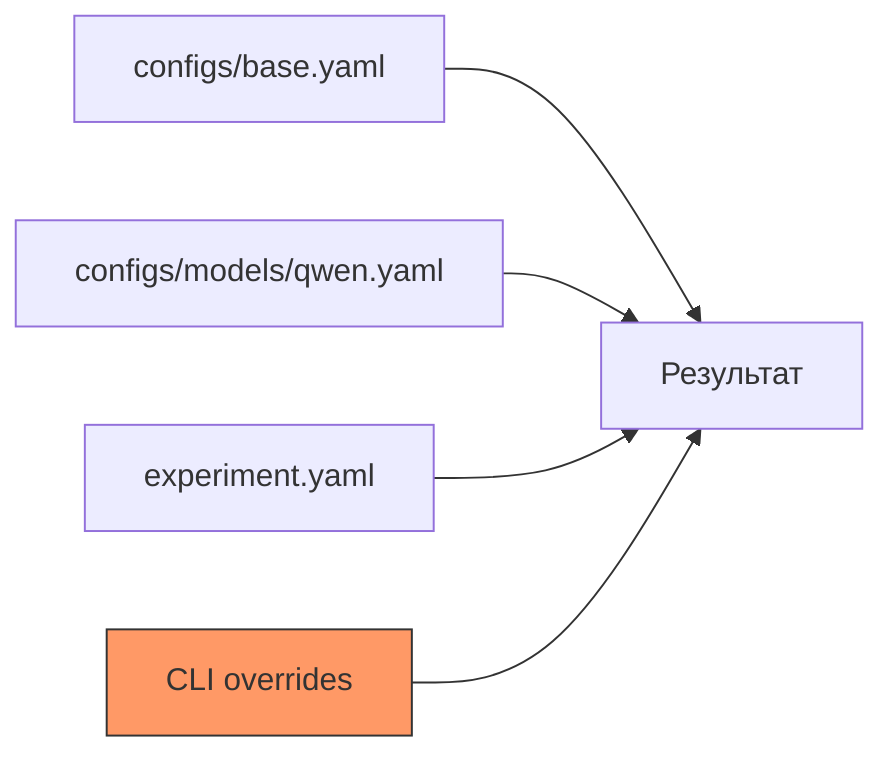

# Конфигурация YAML

Все эксперименты в pulsar-ai описываются YAML-конфигами. Конфиг содержит настройки модели, обучения, датасета, LoRA, экспорта и логирования.

---

## Приоритет параметров

Параметры применяются в следующем порядке (от низшего к высшему приоритету):

1. **Базовые конфиги** (через `inherit`) -- слева направо
2. **Основной конфиг** эксперимента
3. **CLI-переопределения** (`pulsar train config.yaml key=value`)

!!! tip "Правило переопределения"
    Поздние значения всегда перезаписывают ранние. Если `inherit: [base, models/qwen]`,
    то `models/qwen` перезаписывает конфликтующие поля из `base`.
    CLI-переопределения имеют наивысший приоритет.

---

## Корневые параметры

| Параметр | Тип | По умолчанию | Описание |
|----------|-----|-------------|----------|
| `inherit` | list[string] | `[]` | Список родительских конфигов для наследования. Пути относительно `configs/` |
| `strategy` | string | `auto` | Стратегия обучения: `auto`, `lora`, `qlora`, `unsloth`, `distributed` |
| `use_unsloth` | bool | `false` | Явно включить Unsloth-оптимизации |
| `load_in_4bit` | bool | `false` | Загрузить модель в 4-bit (QLoRA) |
| `gradient_checkpointing` | bool | `true` | Включить gradient checkpointing для экономии VRAM |

---

## Секция `model`

Настройки базовой модели.

| Параметр | Тип | По умолчанию | Описание |
|----------|-----|-------------|----------|
| `name` | string | -- | Короткое имя модели (например, `qwen2.5-3b`) |
| `name_full` | string | -- | Полный HuggingFace ID (например, `Qwen/Qwen2.5-3B-Instruct`) |
| `family` | string | -- | Семейство: `qwen3`, `llama`, `mistral`, `gemma` |
| `max_seq_length` | int | `2048` | Максимальная длина последовательности |
| `chat_template` | string | `chatml` | Шаблон чата: `chatml`, `llama3`, `mistral` |

**Пример:**

```yaml
model:
  name: qwen2.5-3b
  name_full: Qwen/Qwen2.5-3B-Instruct
  family: qwen3
  max_seq_length: 2048
  chat_template: chatml
```

---

## Секция `training`

Гиперпараметры обучения.

| Параметр | Тип | По умолчанию | Описание |
|----------|-----|-------------|----------|
| `epochs` | int | `3` | Количество эпох обучения |
| `learning_rate` | float | `2e-4` | Скорость обучения |
| `batch_size` | int | `4` | Размер батча на GPU |
| `gradient_accumulation` | int | `4` | Шаги аккумуляции градиентов |
| `warmup_steps` | int | `10` | Количество шагов прогрева |
| `max_seq_length` | int | `2048` | Максимальная длина последовательности (переопределяет `model.max_seq_length`) |
| `logging_steps` | int | `1` | Частота логирования (в шагах) |
| `seed` | int | `42` | Random seed для воспроизводимости |
| `optimizer` | string | `adamw_8bit` | Оптимизатор: `adamw_8bit`, `adamw_torch` |

!!! info "adamw_8bit vs adamw_torch"
    `adamw_8bit` использует bitsandbytes для 8-битного оптимизатора, экономит ~30% VRAM.
    `adamw_torch` -- стандартный PyTorch-оптимизатор, точнее но требует больше памяти.

**Пример:**

```yaml
training:
  epochs: 3
  learning_rate: 2e-4
  batch_size: 4
  gradient_accumulation: 4
  warmup_steps: 10
  max_seq_length: 2048
  logging_steps: 1
  seed: 42
  optimizer: adamw_8bit
```

---

## Секция `lora`

Параметры LoRA-адаптера.

| Параметр | Тип | По умолчанию | Описание |
|----------|-----|-------------|----------|
| `r` | int | `16` | Ранг LoRA-матриц |
| `lora_alpha` | int | `16` | Коэффициент масштабирования LoRA |
| `target_modules` | list[string] | см. ниже | Целевые модули для LoRA |
| `lora_dropout` | float | `0.0` | Dropout для LoRA-слоёв |
| `bias` | string | `none` | Bias-стратегия: `none`, `all`, `lora_only` |

!!! note "target_modules по умолчанию"
    Для большинства моделей: `["q_proj", "k_proj", "v_proj", "o_proj", "gate_proj", "up_proj", "down_proj"]`.
    Значения зависят от семейства модели и задаются в базовых конфигах.

**Пример:**

```yaml
lora:
  r: 16
  lora_alpha: 16
  target_modules:
    - q_proj
    - k_proj
    - v_proj
    - o_proj
    - gate_proj
    - up_proj
    - down_proj
  lora_dropout: 0.0
  bias: none
```

---

## Секция `dataset`

Настройки датасета.

| Параметр | Тип | По умолчанию | Описание |
|----------|-----|-------------|----------|
| `path` | string | -- | Путь к файлу датасета |
| `format` | string | `auto` | Формат: `csv`, `jsonl`, `json`, `parquet`, `xlsx`, `auto` |
| `text_column` | string | `text` | Имя колонки с текстом |
| `label_columns` | list[string] | `[]` | Список колонок с метками |
| `system_prompt_file` | string | `None` | Путь к файлу с системным промптом |
| `test_size` | float | `0.15` | Доля тестовой выборки (0.0 -- 1.0) |

!!! tip "Автоопределение формата"
    При `format: auto` формат определяется по расширению файла:
    `.csv` -> CSV, `.jsonl` -> JSONL, `.json` -> JSON, `.parquet` -> Parquet, `.xlsx` -> Excel.

**Пример:**

```yaml
dataset:
  path: data/customer-intent.csv
  format: csv
  text_column: text
  label_columns:
    - intent
  system_prompt_file: prompts/classifier.txt
  test_size: 0.15
```

---

## Секция `output`

Настройки вывода и экспорта.

| Параметр | Тип | По умолчанию | Описание |
|----------|-----|-------------|----------|
| `dir` | string | `./outputs` | Директория для результатов |
| `save_adapter` | bool | `true` | Сохранить LoRA-адаптер |
| `export_gguf` | bool | `false` | Автоматически экспортировать в GGUF после обучения |
| `quantization` | string | `q4_k_m` | Уровень квантизации для GGUF-экспорта |

**Пример:**

```yaml
output:
  dir: ./outputs/cam-sft
  save_adapter: true
  export_gguf: true
  quantization: q4_k_m
```

---

## Секция `dpo`

Параметры DPO-обучения (Direct Preference Optimization).

| Параметр | Тип | По умолчанию | Описание |
|----------|-----|-------------|----------|
| `beta` | float | `0.1` | Температурный параметр DPO |
| `max_length` | int | `2048` | Максимальная длина пары |
| `pairs_path` | string | -- | Путь к файлу с парами предпочтений (JSONL) |

!!! warning "Требования к DPO"
    DPO требует предварительно обученный SFT-адаптер (`--base-model` в CLI или
    `sft_adapter_path` в конфиге). Файл пар должен содержать поля `chosen` и `rejected`.

**Пример:**

```yaml
dpo:
  beta: 0.1
  max_length: 2048
  pairs_path: ./outputs/cam-sft/dpo_pairs.jsonl
```

---

## Секция `hpo`

Параметры оптимизации гиперпараметров (Optuna).

| Параметр | Тип | По умолчанию | Описание |
|----------|-----|-------------|----------|
| `method` | string | `tpe` | Метод поиска: `tpe`, `random`, `grid` |
| `metric` | string | `training_loss` | Метрика оптимизации |
| `direction` | string | `minimize` | Направление: `minimize`, `maximize` |
| `n_trials` | int | `10` | Количество триалов |
| `search_space` | dict | `{}` | Пространство поиска (см. ниже) |

Формат `search_space`:

```yaml
hpo:
  method: tpe
  metric: training_loss
  direction: minimize
  n_trials: 20
  search_space:
    learning_rate:
      type: float
      low: 1e-5
      high: 5e-4
      log: true
    epochs:
      type: int
      low: 1
      high: 5
    lora_r:
      type: categorical
      choices: [8, 16, 32, 64]
```

---

## Секция `logging`

Настройки логирования и трекинга.

| Параметр | Тип | По умолчанию | Описание |
|----------|-----|-------------|----------|
| `level` | string | `INFO` | Уровень логирования: `DEBUG`, `INFO`, `WARNING`, `ERROR` |
| `report_to` | string | `none` | Трекер: `none`, `clearml`, `wandb` |

**Пример:**

=== "Без трекинга"

    ```yaml
    logging:
      level: INFO
      report_to: none
    ```

=== "W&B"

    ```yaml
    logging:
      level: INFO
      report_to: wandb
    ```

=== "ClearML"

    ```yaml
    logging:
      level: DEBUG
      report_to: clearml
    ```

---

## Наследование конфигов (`inherit`)

Механизм `inherit` позволяет строить иерархию конфигов. Пути разрешаются относительно директории `configs/`.

```yaml
inherit:
  - base           # configs/base.yaml
  - models/qwen    # configs/models/qwen.yaml
  - tasks/dpo      # configs/tasks/dpo.yaml
```

**Семантика слияния:**

- Конфиги применяются слева направо
- Словари сливаются рекурсивно (`deep merge`)
- Скалярные значения перезаписываются
- Списки полностью заменяются (не конкатенируются)
- CLI-переопределения (`key=value`) применяются последними



---

## Полный пример конфига

```yaml
# configs/experiments/customer-intent.yaml

inherit:
  - base
  - models/qwen2.5-3b

strategy: auto
use_unsloth: true
load_in_4bit: true
gradient_checkpointing: true

model:
  name: qwen2.5-3b
  name_full: Qwen/Qwen2.5-3B-Instruct
  family: qwen3
  max_seq_length: 2048
  chat_template: chatml

training:
  epochs: 3
  learning_rate: 2e-4
  batch_size: 4
  gradient_accumulation: 4
  warmup_steps: 10
  max_seq_length: 2048
  logging_steps: 1
  seed: 42
  optimizer: adamw_8bit

lora:
  r: 16
  lora_alpha: 16
  target_modules:
    - q_proj
    - k_proj
    - v_proj
    - o_proj
    - gate_proj
    - up_proj
    - down_proj
  lora_dropout: 0.0
  bias: none

dataset:
  path: data/customer-intent.csv
  format: csv
  text_column: text
  label_columns:
    - intent
  system_prompt_file: prompts/classifier.txt
  test_size: 0.15

output:
  dir: ./outputs/customer-intent
  save_adapter: true
  export_gguf: true
  quantization: q4_k_m

logging:
  level: INFO
  report_to: none
```
