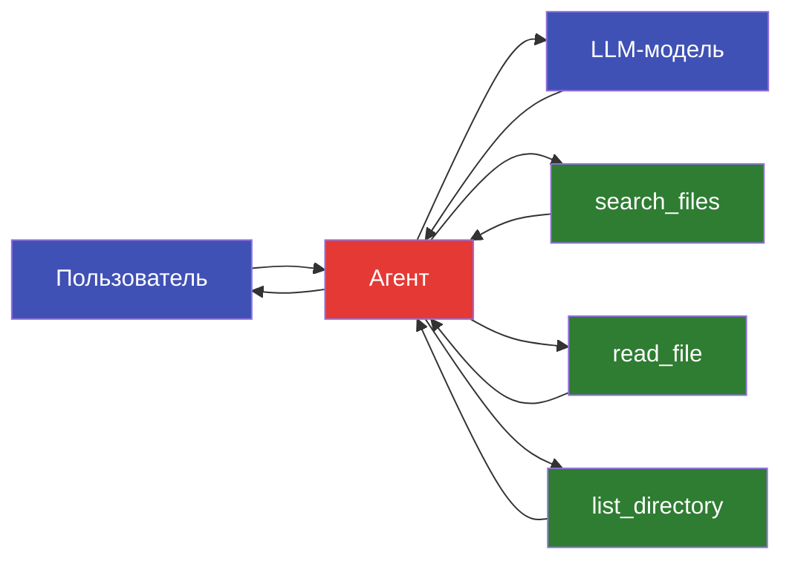

# Агент с инструментами

Создание AI-агента с доступом к инструментам файловой системы: от инициализации до деплоя как REST API.

---

## Цель

Создать агента-ассистента, который может:

- Искать файлы по имени и содержимому
- Читать содержимое файлов
- Получать информацию о директориях
- Отвечать на вопросы пользователя, используя инструменты



---

## 1. Инициализация агента

```bash
pulsar agent init file-assistant
```

Ожидаемый вывод:

```
Agent config created: configs/agents/file-assistant.yaml
Tools directory: configs/agents/tools/
```

---

## 2. Структура конфига агента

```yaml title="configs/agents/file-assistant.yaml"
# ─── Агент ───
agent:
  name: file-assistant
  description: "AI-ассистент для работы с файлами"
  max_iterations: 10        # Макс. циклов размышления
  verbose: true              # Логировать цепочку рассуждений

# ─── Модель ───
model:
  url: "http://localhost:8080/v1"
  name: "default"
  temperature: 0.1
  max_tokens: 1024

# ─── Инструменты ───
tools:
  - name: search_files
    description: "Поиск файлов по имени или паттерну"
    parameters:
      - name: pattern
        type: string
        description: "Glob-паттерн для поиска (например, '*.py')"
        required: true
      - name: directory
        type: string
        description: "Директория для поиска"
        default: "."

  - name: read_file
    description: "Чтение содержимого файла"
    parameters:
      - name: path
        type: string
        description: "Путь к файлу"
        required: true
      - name: max_lines
        type: integer
        description: "Максимальное количество строк"
        default: 100

  - name: list_directory
    description: "Получение списка файлов и директорий"
    parameters:
      - name: path
        type: string
        description: "Путь к директории"
        default: "."
      - name: recursive
        type: boolean
        description: "Рекурсивный обход"
        default: false

# ─── Память ───
memory:
  type: buffer            # buffer | summary | vector
  max_messages: 20        # Размер буфера сообщений

# ─── Guardrails ───
guardrails:
  input:
    - type: prompt_injection
      action: block
    - type: length
      max_chars: 2000
  output:
    - type: pii
      action: mask
    - type: length
      max_chars: 5000
```

---

## 3. Разбор секций конфига

### agent

| Параметр | Описание |
|----------|----------|
| `name` | Уникальное имя агента |
| `description` | Описание для документации и метаданных |
| `max_iterations` | Защита от бесконечных циклов размышления |
| `verbose` | Выводить промежуточные шаги (Thought / Action / Observation) |

### model

Подключение к LLM-серверу через OpenAI-совместимый API. Можно использовать:

=== "Локальный pulsar serve"

    ```yaml
    model:
      url: "http://localhost:8080/v1"
      name: "default"
    ```

=== "Ollama"

    ```yaml
    model:
      url: "http://localhost:11434/v1"
      name: "qwen3.5:0.8b"
    ```

=== "OpenAI"

    ```yaml
    model:
      url: "https://api.openai.com/v1"
      name: "gpt-4o-mini"
      api_key: "${OPENAI_API_KEY}"
    ```

### tools

Каждый инструмент -- это функция, которую агент может вызвать. Описания (`description`) критически важны: модель решает, какой инструмент использовать, на основе описаний.

!!! tip "Качество описаний"
    Чем точнее описания инструментов и их параметров, тем лучше агент выбирает
    правильный инструмент. Включайте примеры использования в `description`.

### memory

| Тип | Описание | Когда использовать |
|-----|----------|-------------------|
| `buffer` | Хранит последние N сообщений | Простые диалоги |
| `summary` | Суммирует старые сообщения через LLM | Длинные диалоги |
| `vector` | Семантический поиск по истории | Сложные многотемные диалоги |

### guardrails

Защита входа и выхода агента:

| Тип | Направление | Действие |
|-----|-------------|----------|
| `prompt_injection` | input | Блокирует попытки манипуляции |
| `length` | input/output | Ограничивает длину текста |
| `pii` | output | Маскирует персональные данные |
| `toxicity` | output | Блокирует токсичный контент |

---

## 4. Интерактивное тестирование

```bash
pulsar agent test configs/agents/file-assistant.yaml
```

Пример диалога:

```
Agent file-assistant ready. Type 'exit' to quit.

> Найди все Python-файлы в директории src/

Thought: Пользователь хочет найти Python-файлы. Использую search_files с паттерном *.py.

Action: search_files(pattern="*.py", directory="src/")

Observation:
  src/pulsar_ai/cli.py
  src/pulsar_ai/config.py
  src/pulsar_ai/training/sft.py
  src/pulsar_ai/training/dpo.py
  src/pulsar_ai/eval/evaluator.py
  src/pulsar_ai/export/gguf.py
  ... (12 files total)

Answer: В директории `src/` найдено 12 Python-файлов. Основные модули:
- `cli.py` — точка входа CLI
- `config.py` — система конфигурации
- `training/` — модули обучения (SFT, DPO)
- `eval/` — оценка моделей
- `export/` — экспорт (GGUF и др.)

Нужно посмотреть содержимое какого-то файла?

> Покажи начало файла config.py

Thought: Нужно прочитать файл config.py. Использую read_file.

Action: read_file(path="src/pulsar_ai/config.py", max_lines=30)

Observation:
  """Configuration system with YAML inheritance."""
  import yaml
  from pathlib import Path
  from dataclasses import dataclass
  ...

Answer: Файл `config.py` содержит систему конфигурации с наследованием YAML.
Первые строки показывают импорт `yaml` и `pathlib`, а также использование
`dataclass` для структур данных.

> exit
```

---

## 5. Деплой как REST API

```bash
pulsar agent serve configs/agents/file-assistant.yaml --port 8081
```

Ожидаемый вывод:

```
Agent: file-assistant
Model: http://localhost:8080/v1 (default)
Tools: search_files, read_file, list_directory
Guardrails: prompt_injection (input), pii (output)

Server running on http://localhost:8081
Endpoints:
  POST /v1/agent/chat     Send message to agent
  GET  /v1/agent/health   Health check
```

---

## 6. Вызов агента из Python

```python title="call_agent.py"
import requests

BASE_URL = "http://localhost:8081/v1/agent"


def chat(message: str, session_id: str = "default") -> str:
    """Отправляет сообщение агенту и возвращает ответ."""
    response = requests.post(
        f"{BASE_URL}/chat",
        json={
            "message": message,
            "session_id": session_id,
        },
        timeout=60,
    )
    response.raise_for_status()
    return response.json()["response"]


# Диалог с агентом
print(chat("Какие файлы есть в корне проекта?"))
print(chat("Покажи содержимое README.md"))
print(chat("Найди все YAML-конфиги"))
```

Для потоковых ответов (SSE):

```python title="call_agent_stream.py"
import json

import requests


def chat_stream(message: str, session_id: str = "default"):
    """Потоковый вызов агента через SSE."""
    response = requests.post(
        "http://localhost:8081/v1/agent/chat",
        json={
            "message": message,
            "session_id": session_id,
            "stream": True,
        },
        stream=True,
        timeout=60,
    )
    response.raise_for_status()

    for line in response.iter_lines():
        if line:
            decoded = line.decode("utf-8")
            if decoded.startswith("data: "):
                data = json.loads(decoded[6:])
                if data["type"] == "thought":
                    print(f"  [Thought] {data['content']}")
                elif data["type"] == "action":
                    print(f"  [Action] {data['tool']}({data['args']})")
                elif data["type"] == "observation":
                    print(f"  [Observation] {data['content'][:100]}...")
                elif data["type"] == "answer":
                    print(f"\n{data['content']}")


chat_stream("Найди файлы с ошибками импорта")
```

---

## 7. Native vs ReAct tool calling

pulsar-ai поддерживает два режима вызова инструментов:

### ReAct (по умолчанию)

Модель генерирует текстовую цепочку Thought -> Action -> Observation:

```
Thought: Мне нужно найти файл config.py
Action: search_files(pattern="config.py")
Observation: src/pulsar_ai/config.py
Thought: Нашёл файл, теперь прочитаю его
Action: read_file(path="src/pulsar_ai/config.py")
Observation: ...
Answer: Вот содержимое файла...
```

!!! info "Когда использовать ReAct"
    - Работает с **любой** моделью (даже маленькие модели 0.8B--2B).
    - Прозрачная цепочка рассуждений (легко отлаживать).
    - Немного медленнее из-за текстового парсинга.

### Native tool calling

Модель использует встроенный механизм function calling (JSON-формат):

```bash
pulsar agent test configs/agents/file-assistant.yaml --native-tools
```

```json
{
  "tool_calls": [
    {
      "function": {
        "name": "search_files",
        "arguments": "{\"pattern\": \"config.py\"}"
      }
    }
  ]
}
```

!!! info "Когда использовать Native"
    - Требует модель с поддержкой tool calling (Qwen 2.5+, Llama 3.1+, GPT-4o).
    - Быстрее и точнее, чем ReAct.
    - Нет видимой цепочки рассуждений (сложнее отлаживать).

| Характеристика | ReAct | Native |
|---------------|-------|--------|
| Совместимость | Любая модель | Только с tool calling |
| Скорость | Медленнее | Быстрее |
| Точность | Хорошая | Отличная |
| Отладка | Прозрачная цепочка | Только вход/выход |
| Конфигурация | По умолчанию | `--native-tools` |

---

## Что дальше?

- **Больше инструментов** -- добавьте веб-поиск, вычисления, работу с БД.
- **Guardrails** -- настройте защиту от prompt injection и утечки данных.
- **Память** -- используйте `vector` memory для долгосрочных диалогов.
- **Pipeline** -- интегрируйте агента в автоматизированный пайплайн.
  См. [Полный Pipeline](full-pipeline.md).
