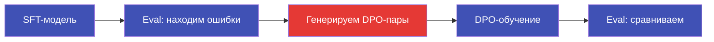
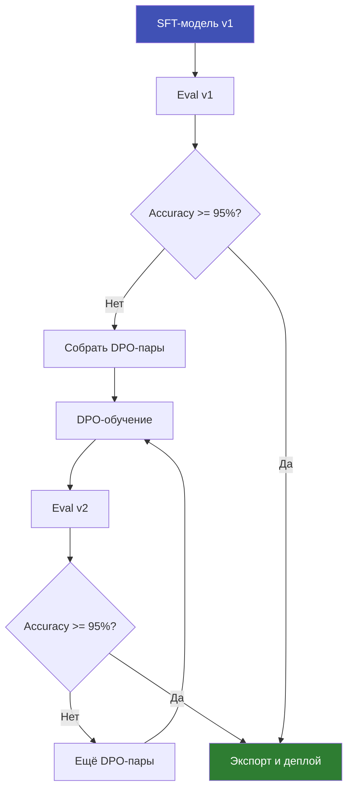

# Чатбот с DPO

Улучшение SFT-модели через Direct Preference Optimization: от анализа ошибок до сравнения результатов.

---

## Обзор

DPO (Direct Preference Optimization) позволяет улучшить модель, обученную через SFT, используя пары "хороший ответ / плохой ответ". Модель учится предпочитать правильные ответы ошибочным без отдельной reward-модели.



---

## 1. Обучение SFT-модели

Если у вас ещё нет SFT-модели, обучите её по туториалу [Intent Classifier (E2E)](intent-classifier.md).

После обучения у вас должна быть директория с адаптером:

```
outputs/cam-sft-qwen3.5-0.8b/
├── lora/
│   ├── adapter_model.safetensors
│   ├── adapter_config.json
│   └── ...
└── training_log.json
```

---

## 2. Анализ ошибок SFT-модели

Запустите eval и сохраните подробный отчёт:

```bash
pulsar eval \
  --model outputs/cam-sft-qwen3.5-0.8b/lora \
  --test-data data/cam_intents_test.csv \
  --output reports/sft-eval/
```

Изучите ошибки в отчёте:

```
Error Analysis (23 errors / 185 samples):

  #1  Input:    "Поставь таймер"
      Expected: {"domain": "DEVICE", "skill": "timer_set"}
      Got:      {"domain": "DEVICE", "skill": "alarm_set"}

  #2  Input:    "Сколько стоит доллар"
      Expected: {"domain": "FINANCE", "skill": "exchange_rate"}
      Got:      {"domain": "WEATHER", "skill": "forecast"}

  #3  Input:    "Закажи такси до аэропорта"
      Expected: {"domain": "TRANSPORT", "skill": "taxi_order"}
      Got:      {"domain": "FOOD", "skill": "food_delivery"}
  ...
```

---

## 3. Генерация DPO-пар

DPO-пара состоит из трёх полей:

- `prompt` -- входное сообщение пользователя
- `chosen` -- правильный ответ (тот, который модель **должна** генерировать)
- `rejected` -- ошибочный ответ (тот, который модель **фактически** выдала)

```jsonl title="data/cam_dpo_pairs.jsonl"
{"prompt": "Поставь таймер", "chosen": "{\"domain\": \"DEVICE\", \"skill\": \"timer_set\"}", "rejected": "{\"domain\": \"DEVICE\", \"skill\": \"alarm_set\"}"}
{"prompt": "Сколько стоит доллар", "chosen": "{\"domain\": \"FINANCE\", \"skill\": \"exchange_rate\"}", "rejected": "{\"domain\": \"WEATHER\", \"skill\": \"forecast\"}"}
{"prompt": "Закажи такси до аэропорта", "chosen": "{\"domain\": \"TRANSPORT\", \"skill\": \"taxi_order\"}", "rejected": "{\"domain\": \"FOOD\", \"skill\": \"food_delivery\"}"}
{"prompt": "Напомни купить молоко", "chosen": "{\"domain\": \"DEVICE\", \"skill\": \"reminder_set\"}", "rejected": "{\"domain\": \"FOOD\", \"skill\": \"food_delivery\"}"}
{"prompt": "Какой курс евро", "chosen": "{\"domain\": \"FINANCE\", \"skill\": \"exchange_rate\"}", "rejected": "{\"domain\": \"FINANCE\", \"skill\": \"money_transfer\"}"}
```

!!! warning "Формат chosen/rejected"
    Значения `chosen` и `rejected` должны **точно** соответствовать формату вывода SFT-модели.
    Не добавляйте лишние пробелы, переносы строк или дополнительные поля.
    Если SFT-модель генерирует `{"domain":"X","skill":"Y"}` без пробелов -- DPO-пары
    тоже должны быть без пробелов.

!!! tip "Сколько пар нужно"
    | Количество пар | Ожидаемый эффект |
    |----------------|-----------------|
    | 50--100 | Минимальное улучшение по конкретным ошибкам |
    | 200--500 | Заметное улучшение precision на проблемных классах |
    | 500+ | Существенное улучшение общего качества |

    Включайте не только реальные ошибки, но и **синтетические** вариации:
    создайте 3--5 перефразировок каждого проблемного примера.

---

## 4. Создание DPO-конфига

```yaml title="configs/examples/cam-dpo-qwen3.5-0.8b.yaml"
# Наследуем базовый конфиг и задачу DPO
inherit:
  - configs/base.yaml
  - configs/models/qwen3.5-0.8b.yaml
  - configs/tasks/dpo.yaml

# Задача
task: dpo

# Путь к SFT-адаптеру (обязательно для DPO)
sft_adapter_path: outputs/cam-sft-qwen3.5-0.8b/lora

# Датасет DPO-пар
dataset:
  path: data/cam_dpo_pairs.jsonl
  format: jsonl

# Параметры DPO
dpo:
  beta: 0.1          # Сила регуляризации (0.1 -- стандарт)
  loss_type: sigmoid  # sigmoid | hinge | ipo

# Обучение
epochs: 3
learning_rate: 5e-5
batch_size: 2
gradient_accumulation_steps: 4
max_seq_length: 256

# Выход
output_dir: outputs/cam-dpo-qwen3.5-0.8b
```

!!! info "Параметр beta"
    `beta` контролирует баланс между обучением на предпочтениях и сохранением поведения
    SFT-модели:

    | beta | Поведение |
    |------|-----------|
    | 0.05 | Агрессивное обучение, больше риск деградации |
    | **0.1** | **Стандартное значение, хороший баланс** |
    | 0.3 | Консервативное обучение, меньше изменений |
    | 0.5 | Очень консервативное, минимальные изменения |

---

## 5. Запуск DPO-обучения

```bash
pulsar train configs/examples/cam-dpo-qwen3.5-0.8b.yaml
```

Ожидаемый вывод:

```
Loading base model Qwen/Qwen3.5-0.8B...
Loading SFT adapter from outputs/cam-sft-qwen3.5-0.8b/lora...
DPO Training: beta=0.1, loss_type=sigmoid
Dataset: 250 pairs

Step 50/190 | Loss: 0.693 | Reward margin: 0.12 | GPU: 3.4 GB
Step 100/190 | Loss: 0.541 | Reward margin: 0.38 | GPU: 3.4 GB
Step 150/190 | Loss: 0.423 | Reward margin: 0.67 | GPU: 3.4 GB
Step 190/190 | Loss: 0.387 | Reward margin: 0.81 | GPU: 3.4 GB

Training complete! DPO adapter saved to outputs/cam-dpo-qwen3.5-0.8b/lora
```

!!! note "Reward margin"
    **Reward margin** -- разница в "награде" между chosen и rejected ответами.
    Рост этой метрики означает, что модель учится предпочитать правильные ответы.
    Значение 0.5+ -- хороший признак.

---

## 6. Оценка DPO-модели

```bash
pulsar eval \
  --model outputs/cam-dpo-qwen3.5-0.8b/lora \
  --test-data data/cam_intents_test.csv \
  --output reports/dpo-eval/
```

---

## 7. Сравнение SFT vs DPO

```bash
pulsar runs compare <sft_run_id> <dpo_run_id>
```

Ожидаемый вывод:

```
┌─────────────────────┬────────────┬────────────┬──────────┐
│ Metric              │ SFT        │ DPO        │ Delta    │
├─────────────────────┼────────────┼────────────┼──────────┤
│ Accuracy            │ 87.5%      │ 90.3%      │ +2.8%    │
│ F1 (weighted)       │ 0.894      │ 0.918      │ +0.024   │
│ JSON Parse Rate     │ 100.0%     │ 100.0%     │ 0.0%     │
│ Precision (macro)   │ 0.885      │ 0.912      │ +0.027   │
│ Recall (macro)      │ 0.876      │ 0.897      │ +0.021   │
│ Avg Latency         │ 42ms       │ 43ms       │ +1ms     │
└─────────────────────┴────────────┴────────────┴──────────┘

Per-class improvement:
  DEVICE:    F1 0.85 → 0.91 (+0.06)  ← largest improvement
  FOOD:      F1 0.82 → 0.86 (+0.04)
  FINANCE:   F1 0.86 → 0.88 (+0.02)
  TRANSPORT: F1 0.79 → 0.85 (+0.06)  ← largest improvement
```

!!! success "Результаты"
    - **Accuracy +2.8%** -- DPO заметно улучшил классификацию.
    - **JSON Parse Rate 100%** -- формат ответа не пострадал.
    - Наибольшее улучшение в классах DEVICE и TRANSPORT -- именно по ним были DPO-пары.
    - Latency практически не изменилась: DPO не увеличивает размер адаптера.

---

## 8. Итеративное улучшение

DPO можно применять итеративно:



!!! warning "Когда остановиться"
    - DPO даёт убывающую отдачу после 2--3 итераций.
    - Если accuracy не растёт -- добавьте больше SFT-данных или возьмите модель побольше.
    - Следите за JSON Parse Rate: если он падает -- уменьшите `beta` или проверьте формат пар.

---

## 9. Что дальше?

- **Экспорт и сервинг** -- см. [Train -> GGUF -> Serve](gguf-serving.md).
- **Автоматизация** -- запускайте SFT+DPO+Eval как единый pipeline.
  См. [Полный Pipeline](full-pipeline.md).
- **Больше данных** -- генерируйте синтетические DPO-пары через LLM-as-Judge.
