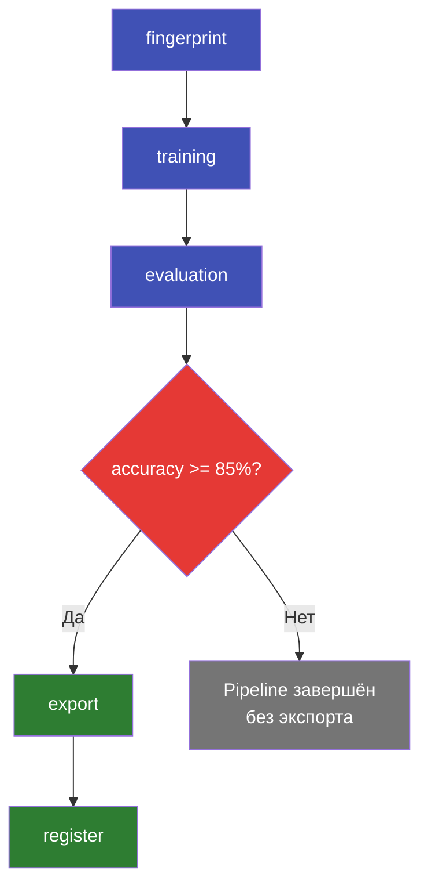
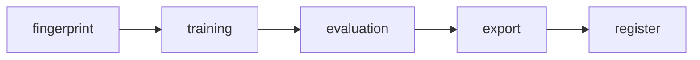

# Полный Pipeline

Автоматизация цикла train -> eval -> conditional export -> register через декларативный YAML-конфиг пайплайна.

---

## Цель

Создать пайплайн, который:

1. Вычисляет fingerprint датасета (для кэширования)
2. Обучает SFT-модель
3. Оценивает качество
4. Экспортирует в GGUF **только если accuracy >= 85%**
5. Регистрирует модель в реестре



---

## 1. Структура Pipeline YAML

Пайплайн -- это YAML-файл с описанием шагов, их зависимостей и условий выполнения.

```yaml title="configs/pipelines/full.yaml"
name: full-training-pipeline
description: "Train → Eval → Export → Register"
version: "1.0"

# Глобальные переменные (доступны во всех шагах)
variables:
  model_name: "Qwen/Qwen3.5-0.8B"
  dataset: "data/cam_intents.csv"
  test_data: "data/cam_intents_test.csv"
  output_base: "outputs/pipeline-run"
  min_accuracy: 0.85

steps:
  # ─── Шаг 1: Fingerprint датасета ───
  - name: fingerprint
    type: dataset_fingerprint
    params:
      path: ${variables.dataset}
      include_stats: true

  # ─── Шаг 2: Обучение ───
  - name: training
    type: train
    depends_on:
      - fingerprint
    params:
      config: configs/examples/cam-sft-qwen3.5-0.8b.yaml
      overrides:
        output_dir: ${variables.output_base}/sft
        epochs: 5
        learning_rate: 3e-4

  # ─── Шаг 3: Оценка ───
  - name: evaluation
    type: eval
    depends_on:
      - training
    params:
      model: ${training.adapter_path}
      test_data: ${variables.test_data}
      output: ${variables.output_base}/eval-report

  # ─── Шаг 4: Экспорт (условный) ───
  - name: export
    type: export
    depends_on:
      - evaluation
    condition: ${evaluation.metrics.accuracy} >= ${variables.min_accuracy}
    params:
      model: ${training.adapter_path}
      format: gguf
      quant: q4_k_m
      output: ${variables.output_base}/model.gguf

  # ─── Шаг 5: Регистрация в реестре ───
  - name: register
    type: registry_register
    depends_on:
      - export
    params:
      name: cam-intent-classifier
      model_path: ${export.output_path}
      base_model: ${variables.model_name}
      tags:
        - pipeline-auto
        - "accuracy-${evaluation.metrics.accuracy}"
      metadata:
        accuracy: ${evaluation.metrics.accuracy}
        f1: ${evaluation.metrics.f1}
        dataset_fingerprint: ${fingerprint.hash}
```

---

## 2. Разбор ключевых механизмов

### Зависимости (`depends_on`)

Каждый шаг может зависеть от одного или нескольких предыдущих шагов. Pipeline Executor выполняет топологическую сортировку DAG и запускает шаги в правильном порядке.



!!! info "Параллельное выполнение"
    Шаги без взаимных зависимостей выполняются параллельно. Например, если бы `fingerprint`
    и `training` не зависели друг от друга, они запустились бы одновременно.

### Подстановка переменных (`${}`)

Переменные подставляются в момент выполнения шага:

| Синтаксис | Источник | Пример |
|-----------|---------|--------|
| `${variables.X}` | Глобальные переменные | `${variables.dataset}` |
| `${step_name.field}` | Выход предыдущего шага | `${training.adapter_path}` |
| `${step.metrics.X}` | Метрики предыдущего шага | `${evaluation.metrics.accuracy}` |

### Условия (`condition`)

Шаг выполняется только если условие истинно:

```yaml
condition: ${evaluation.metrics.accuracy} >= ${variables.min_accuracy}
```

Поддерживаемые операторы: `>=`, `<=`, `>`, `<`, `==`, `!=`.

!!! warning "Пропущенные шаги"
    Если условие ложно, шаг и все зависящие от него шаги будут пропущены.
    В примере выше: если accuracy < 85%, шаги `export` и `register` не выполнятся.

---

## 3. Запуск пайплайна

```bash
pulsar pipeline run configs/pipelines/full.yaml
```

Ожидаемый вывод:

```
Pipeline: full-training-pipeline v1.0
Steps: 5 (fingerprint → training → evaluation → export → register)

[1/5] fingerprint .................. DONE (2s)
      Dataset: 1234 rows, hash: a1b2c3d4
[2/5] training ..................... DONE (14m 32s)
      Adapter: outputs/pipeline-run/sft/lora
      Final loss: 0.098
[3/5] evaluation ................... DONE (45s)
      Accuracy: 87.5%, F1: 0.894
[4/5] export ....................... DONE (1m 12s)
      Condition: 0.875 >= 0.85 ✓
      Output: outputs/pipeline-run/model.gguf (530 MB)
[5/5] register ..................... DONE (1s)
      Registered: cam-intent-classifier (accuracy-0.875)

Pipeline completed successfully in 16m 32s
```

---

## 4. Мониторинг через WebSocket

Pipeline поддерживает real-time мониторинг через WebSocket. Подключитесь для получения обновлений по каждому шагу:

```javascript title="monitor.js"
const ws = new WebSocket("ws://localhost:8888/ws/pipeline");

ws.onopen = () => {
  console.log("Connected to pipeline WebSocket");
};

ws.onmessage = (event) => {
  const data = JSON.parse(event.data);

  switch (data.type) {
    case "step_started":
      console.log(`[START] ${data.step_name}`);
      break;

    case "step_progress":
      console.log(
        `[PROGRESS] ${data.step_name}: ${data.progress}%` +
        (data.message ? ` - ${data.message}` : "")
      );
      break;

    case "step_completed":
      console.log(`[DONE] ${data.step_name} (${data.duration}s)`);
      if (data.metrics) {
        console.log("  Metrics:", JSON.stringify(data.metrics));
      }
      break;

    case "step_skipped":
      console.log(`[SKIP] ${data.step_name}: ${data.reason}`);
      break;

    case "step_failed":
      console.error(`[FAIL] ${data.step_name}: ${data.error}`);
      break;

    case "pipeline_completed":
      console.log(`Pipeline finished: ${data.status} (${data.total_duration}s)`);
      ws.close();
      break;
  }
};

ws.onerror = (error) => {
  console.error("WebSocket error:", error);
};
```

Пример вывода:

```
Connected to pipeline WebSocket
[START] fingerprint
[DONE] fingerprint (2s)
[START] training
[PROGRESS] training: 15% - Step 100/660, loss: 1.842
[PROGRESS] training: 30% - Step 200/660, loss: 0.934
[PROGRESS] training: 45% - Step 300/660, loss: 0.487
[PROGRESS] training: 61% - Step 400/660, loss: 0.231
[PROGRESS] training: 76% - Step 500/660, loss: 0.142
[DONE] training (872s)
  Metrics: {"final_loss":0.098,"adapter_path":"outputs/pipeline-run/sft/lora"}
[START] evaluation
[DONE] evaluation (45s)
  Metrics: {"accuracy":0.875,"f1":0.894,"json_parse_rate":1.0}
[START] export
[DONE] export (72s)
[START] register
[DONE] register (1s)
Pipeline finished: completed (992s)
```

---

## 5. Проверка результатов

### Список запусков пайплайнов

```bash
pulsar pipeline list
```

```
┌──────────────────────────┬────────────┬───────────┬──────────┐
│ Name                     │ Status     │ Steps     │ Duration │
├──────────────────────────┼────────────┼───────────┼──────────┤
│ full-training-pipeline   │ completed  │ 5/5       │ 16m 32s  │
│ full-training-pipeline   │ completed  │ 4/5 (1↓)  │ 15m 20s  │
│ quick-eval               │ failed     │ 2/3       │ 3m 12s   │
└──────────────────────────┴────────────┴───────────┴──────────┘
```

### Реестр моделей

```bash
pulsar registry list --name cam-intent-classifier
```

```
┌──────────────────────────┬─────────┬───────────────────┬─────────────────┐
│ Name                     │ Status  │ Tags              │ Accuracy        │
├──────────────────────────┼─────────┼───────────────────┼─────────────────┤
│ cam-intent-classifier    │ registered │ pipeline-auto, accuracy-0.875 │ 87.5% │
└──────────────────────────┴─────────┴───────────────────┴─────────────────┘
```

### Продвижение модели

```bash
# В staging для тестирования
pulsar registry promote cam-intent-classifier staging

# После проверки -- в production
pulsar registry promote cam-intent-classifier production
```

---

## 6. Продвинутые сценарии

### Pipeline с DPO

```yaml title="configs/pipelines/sft-dpo.yaml"
name: sft-then-dpo
steps:
  - name: sft_training
    type: train
    params:
      config: configs/examples/cam-sft-qwen3.5-0.8b.yaml

  - name: sft_eval
    type: eval
    depends_on: [sft_training]
    params:
      model: ${sft_training.adapter_path}
      test_data: data/cam_intents_test.csv

  - name: dpo_training
    type: train
    depends_on: [sft_eval]
    condition: ${sft_eval.metrics.accuracy} < 0.95
    params:
      config: configs/examples/cam-dpo-qwen3.5-0.8b.yaml
      overrides:
        sft_adapter_path: ${sft_training.adapter_path}

  - name: dpo_eval
    type: eval
    depends_on: [dpo_training]
    params:
      model: ${dpo_training.adapter_path}
      test_data: data/cam_intents_test.csv

  - name: export
    type: export
    depends_on: [dpo_eval]
    params:
      model: ${dpo_training.adapter_path}
      format: gguf
      quant: q4_k_m
```

### Параллельные шаги

```yaml title="Параллельное обучение двух моделей"
steps:
  - name: train_small
    type: train
    params:
      config: configs/examples/cam-sft-qwen3.5-0.8b.yaml

  - name: train_medium
    type: train
    params:
      config: configs/examples/cam-sft-qwen3.5-2b.yaml

  # Оба обучения запустятся параллельно (нет depends_on)
  - name: compare
    type: eval_compare
    depends_on: [train_small, train_medium]
    params:
      models:
        - ${train_small.adapter_path}
        - ${train_medium.adapter_path}
      test_data: data/cam_intents_test.csv
```

---

## Что дальше?

- **Расписание** -- запускайте пайплайны по cron для регулярного переобучения.
- **Webhook-уведомления** -- настройте Slack/Telegram уведомления о завершении.
- **Visual Workflow Builder** -- создавайте пайплайны визуально через drag-and-drop
  в Web UI на странице **Workflows**.
